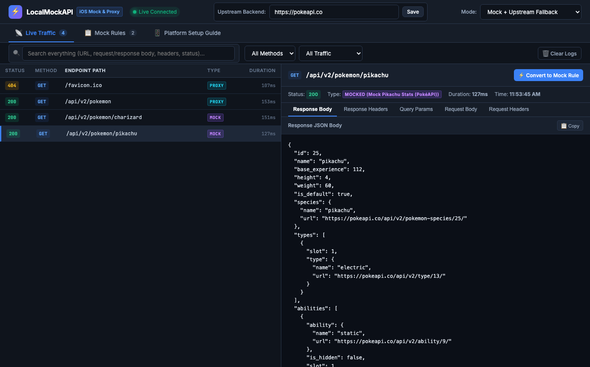
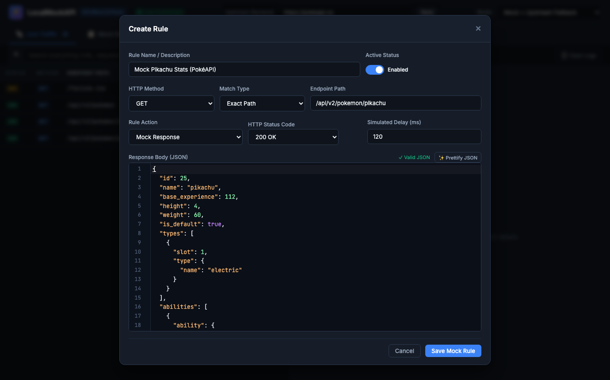

# ⚡ ios-mock-proxy (LocalMockAPI)

> **Zero-Sudo, Zero-Certificate Local API Mock & Reverse Proxy Server with a Live Web GUI Dashboard for iOS, Mobile, and Web Engineers.**

[](https://nodejs.org/)
[-blue.svg)]()
[]()
[](LICENSE)

---

## 🎯 Why This Project Exists

Mocking API responses for **iOS Simulator** and **Xcode** has always been notoriously painful:
- ❌ **Root/Sudo Blockers**: Most traditional proxies (Charles, Proxyman, Mitmproxy) require system-level helper tools and `sudo` access, which are blocked on corporate-managed MacBooks.
- ❌ **SSL Certificate Hassle**: Installing and trusting custom root CA certificates inside the iOS Simulator trust store frequently breaks with App Transport Security (ATS) and VPN tunnels.
- ❌ **Xcode Limitations**: Xcode does not provide a native, lightweight visual API interceptor and mock server that just works out of the box.

### 💡 The Solution: Local Reverse Proxy
**`ios-mock-proxy`** replaces complicated MITM proxies with a lightweight, user-space reverse proxy running on `http://localhost:8080`. 
- ✅ **No `sudo` or admin privileges required**.
- ✅ **No root CA SSL certificate installation needed**.
- ✅ **Zero npm dependencies** (built 100% with native Node.js core modules).
- ✅ **Multi-Platform Support**: Works seamlessly with **iOS Simulator**, **Android Emulator**, **Flutter**, **React Native**, and **Web Frontends**.

```
+---------------------------------------------------------------------------------------------------+
|                        Client Apps (iOS / Android / Flutter / RN / Web)                           |
|                     Base URL: http://localhost:8080 (or http://10.0.2.2:8080)                     |
+---------------------------------------------------------------------------------------------------+
                                                  |
                                                  v
+---------------------------------------------------------------------------------------------------+
|                                      ios-mock-proxy Server                                        |
|                                                                                                   |
|  +---------------------------+                      +------------------------------------------+  |
|  |     Mock Rule Matched?    | ------- YES -------> | Return Simulated Response (Local Engine) |  |
|  +---------------------------+                      +------------------------------------------+  |
|                |                                                                                  |
|               NO                                                                                  |
|                v                                                                                  |
|  +---------------------------+                      +------------------------------------------+  |
|  |   Modify Request Rule?    | ------- YES -------> | Mutate Body / Params & Proxy to Upstream |  |
|  +---------------------------+                      +------------------------------------------+  |
|                |                                                         |                        |
|               NO                                                         |                        |
|                +----------------------------+----------------------------+                        |
|                                             |                                                     |
|                                             v                                                     |
|                               Forward to Remote Upstream                                          |
|                             (e.g., https://api.example.com)                                       |
+---------------------------------------------------------------------------------------------------+
                                              |
                                              v
+---------------------------------------------------------------------------------------------------+
|                    Live Web Dashboard (SSE Stream): http://localhost:8080/_admin/                  |
+---------------------------------------------------------------------------------------------------+
```

---

## ✨ Key Features

- 🛡️ **Zero-Sudo & User-Space Operation**: Runs entirely as a standard user process on your Mac. Doesn't touch your network settings or system certificates.
- ⚡ **Zero External Dependencies**: Powered entirely by native Node.js libraries (`http`, `https`, `url`, `zlib`, `crypto`, `fs`). Instant startup with no `node_modules` clutter.
- 📊 **Real-Time Live Traffic Inspector**: Streams incoming requests, query parameters, request bodies, response headers, status codes, and execution duration in real time via Server-Sent Events (SSE).
- 🔍 **Deep Universal Search**: Filter instantly across endpoints, HTTP verbs, status codes, query strings, headers, and request/response JSON payloads.
- 🎭 **Dual Mock & Rewrite Capabilities**:
  - **Mock Response**: Return mocked JSON responses with custom HTTP status codes (`200 OK`, `400 Bad Request`, `401 Unauthorized`, `404 Not Found`, `422 Unprocessable`, `500 Internal Error`, etc.) and configurable network latency/delays.
  - **Modify Request (Proxy Mutation)**: Intercept outgoing requests, mutate their URL query parameters or request body on the fly, and forward the altered request to your remote backend.
- 📝 **CodeMirror JSON Editor**: Includes line numbers, brace folding ribbon, active line highlight, and one-click JSON formatting.
- 🔄 **One-Click Rule Creation**: Turn any recorded network call from the live traffic pane into a permanent or temporary mock rule with one click.
- 🌐 **Seamless Upstream Fallback**: Any unmocked route is transparently proxied to your remote staging or production backend.

---

## 📸 Visual Demo & Screenshots

### 1. Live Traffic Inspector & Deep Search
Stream live network requests from your iOS Simulator, inspect headers, query parameters, request bodies, and mock status in real time:



---

### 2. CodeMirror Mock Rule Editor with Ribbon
Create or edit mock responses effortlessly with line numbers, syntax highlighting, active line highlight, and brace folding:



---

## 🎬 3-Step Demo: How to Mock an API in 30 Seconds

### Step 1: Define Your Mock Rule in Dashboard
1. Open `http://localhost:8080/_admin/` and click **＋ Create Mock Rule**.
2. Set Endpoint Path to `/api/v1/user/profile` and Status Code to `200 OK`.
3. Paste your desired JSON payload in the CodeMirror editor:
   ```json
   {
     "status": "success",
     "data": {
       "user_id": "usr_1024",
       "name": "Sarah Connor",
       "email": "sarah@example.com",
       "role": "developer",
       "theme": "dark",
       "notifications_enabled": true
     }
   }
   ```
4. Click **Save Mock Rule**.

### Step 2: Call the Endpoint from your iOS App or Terminal
Run the request from your iOS Simulator or terminal:
```bash
curl -i http://localhost:8080/api/v1/user/profile
```

### Step 3: Instant Live Verification
Your iOS app instantly receives the mocked JSON payload, and the request appears live in the **Live Traffic** pane with a `[MOCK]` badge!
```
HTTP/1.1 200 OK
Content-Type: application/json; charset=utf-8
Access-Control-Allow-Origin: *

{
  "status": "success",
  "data": {
    "user_id": "usr_1024",
    "name": "Sarah Connor",
    "email": "sarah@example.com",
    "role": "developer",
    "theme": "dark",
    "notifications_enabled": true
  }
}
```

---

## 🛠️ Tech Stack

| Component | Technology | Description |
| :--- | :--- | :--- |
| **Backend Runtime** | Node.js 18+ | Zero-dependency HTTP/HTTPS reverse proxy and static server |
| **Persistence** | File JSON Storage (`data/`) | Atomic file-based storage for rules and configuration |
| **Live Streaming** | Server-Sent Events (SSE) | Real-time traffic broadcast to dashboard |
| **Frontend UI** | HTML5, CSS3, ES6+ JavaScript | Dark-themed responsive dashboard |
| **Editor** | CodeMirror 5 | Embedded JSON editor with folding ribbon |

---

## 🚀 Quick Start

### 1. Clone & Run

```bash
git clone https://github.com/wiradifit/ios-mock-proxy.git
cd ios-mock-proxy
./start.sh
```

*(Alternatively, run `npm start` or `node server.js`)*

### 2. Open the Web Dashboard

Navigate to:

👉 **[http://localhost:8080/_admin/](http://localhost:8080/_admin/)**

In the top bar, enter your remote staging URL (e.g. `https://api-staging.example.com`) and click **Save**.

---

## 📱 Multi-Platform Integration Guides

### 🍎 iOS (Swift, SwiftUI, UIKit, Alamofire, Moya)

Because the iOS Simulator runs on your Mac's network loopback, you can connect directly to `localhost`:

```swift
// Swift API Configuration Example
struct APIConfig {
    #if DEBUG
    // Point to local mock proxy during development & testing
    static let baseURL = URL(string: "http://localhost:8080/api/")!
    #else
    static let baseURL = URL(string: "https://api.example.com/api/")!
    #endif
}
```

> **Physical iPhone on Wi-Fi:**
> If testing on a physical iOS device connected to the same Wi-Fi as your Mac, find your Mac's local IP via `ipconfig getifaddr en0` and set `baseURL = URL(string: "http://192.168.1.50:8080/api/")!`.

> **App Transport Security (ATS) Note:**
> Ensure local HTTP loads are enabled in your app's `Info.plist` during development:
> ```xml
> <key>NSAppTransportSecurity</key>
> <dict>
>     <key>NSAllowsLocalNetworking</key>
>     <true/>
> </dict>
> ```

---

### 🤖 Android (Kotlin, Java, Retrofit, OkHttp)

Android Emulators access the host machine's `localhost` via the special IP `10.0.2.2`:

```kotlin
// Kotlin / Retrofit Configuration Example
val baseUrl = if (BuildConfig.DEBUG) {
    "http://10.0.2.2:8080/api/" // Points to your Mac's localhost:8080
} else {
    "https://api.example.com/api/"
}
```

---

### 💙 Flutter & ⚛️ React Native

```dart
// Flutter (Dart) Example
import 'dart:io';

String getBaseUrl() {
  if (Platform.isAndroid) {
    return 'http://10.0.2.2:8080/api'; // Android Emulator
  } else {
    return 'http://localhost:8080/api'; // iOS Simulator & macOS
  }
}
```

```typescript
// React Native Example
import { Platform } from 'react-native';

const BASE_URL = Platform.select({
  ios: 'http://localhost:8080/api',
  android: 'http://10.0.2.2:8080/api',
  default: 'http://localhost:8080/api',
});
```

---

### 💻 Web & Single-Page Apps (React, Vue, Vite, Next.js, Axios)

Set your `.env.development` or Axios base URL:

```bash
VITE_API_BASE_URL=http://localhost:8080/api
```

---

## 🎯 Mocking & Request Mutation Rules

### 1. Mock Response Mode
Simulate responses without touching the backend:
- **HTTP Status Codes**: `200`, `201`, `400`, `401`, `403`, `404`, `422`, `500`, `502`, `503`.
- **Latency Simulation**: Add `500ms`, `2000ms`, etc., to test UI skeleton loaders and timeout edge cases.
- **Payload Editing**: Full syntax-highlighted JSON editor with brace folding.

### 2. Modify Request (Proxy Rewrite Mode)
Intercept and mutate incoming requests before they hit the upstream backend:
- **Query Params Override**: Add, update, or remove (`null`) query parameters dynamically.
- **Request Body Override**: Replace the request JSON payload on the fly.

### 3. URL Matching Types
- **Exact Path (`exact`)**: Matches exact path (e.g., `/api/v1/users/profile`).
- **Prefix Match (`prefix`)**: Matches any URL starting with the prefix (e.g., `/api/v1/auth/`).
- **Wildcard Match (`wildcard`)**: Glob pattern matching (e.g., `/api/v1/orders/*/details`).

---

## 📂 Project Structure

```
ios-mock-proxy/
├── README.md               # Complete multi-platform documentation
├── package.json            # Project manifest & keywords
├── start.sh                # Instant startup script
├── server.js               # Zero-dependency reverse proxy & SSE server
├── data/
│   ├── config.json         # Server configuration (port, upstream, mode)
│   └── rules.json          # Persistent mock & rewrite rules
└── public/
    ├── index.html          # Web GUI Dashboard
    ├── style.css           # Modern dark-mode styling
    └── app.js              # Live SSE traffic inspector & CodeMirror logic
```

---

## 🔌 REST Admin API Reference

The dashboard interacts with `ios-mock-proxy` via internal REST endpoints:

| Method | Endpoint | Description |
| :--- | :--- | :--- |
| `GET` | `/_api/events` | Server-Sent Events (SSE) live traffic stream |
| `GET` | `/_api/config` | Get current server configuration |
| `POST` | `/_api/config` | Update server configuration (upstream, mode, port) |
| `GET` | `/_api/rules` | List all mock and rewrite rules |
| `POST` | `/_api/rules` | Create or update a rule |
| `POST` | `/_api/rules/:id/toggle` | Toggle rule enabled/disabled status |
| `DELETE` | `/_api/rules/:id` | Delete a rule |
| `GET` | `/_api/traffic` | Retrieve in-memory traffic history |
| `DELETE` | `/_api/traffic` | Clear recorded traffic logs |

---

## 🔒 Security Architecture & Network Safety

`ios-mock-proxy` is engineered with defense-in-depth measures to ensure safe local network interception:

### 1. Zero-Sudo & User-Space Isolation
- Runs entirely as an unprivileged, standard user process.
- Does not modify OS network adapter configurations, packet filters (`pf`), or system trust stores.
- Does not install kernel extensions or background system daemons.

### 2. Path Traversal & File Access Protection
- All static asset requests under `/_admin/` are strictly normalized and resolved against `public/`.
- Paths attempting traversal (e.g. `/_admin/../../../../etc/passwd`) are detected and blocked with `403 Forbidden: Access Denied`.

### 3. Denial of Service (DoS) & Memory Exhaustion Defenses
- **Payload Ceiling (`MAX_BODY_SIZE = 25 MB`)**: Request streams exceeding 25 MB are immediately terminated with `413 Payload Too Large`.
- **Log Payload Bounding (`512 KB`)**: Traffic history payloads are truncated in the UI logger to prevent memory exhaustion during heavy sessions.
- **Ring-Buffered Logs (`maxTrafficHistory = 150`)**: In-memory logs automatically roll over to guarantee fixed memory consumption.

### 4. Protocol Validation & Anti-SSRF Safeguards
- Upstream target URLs are strictly validated to allow only `http://` and `https://` schemes.
- Configuration payloads are scrubbed to eliminate Prototype Pollution (`__proto__`, `constructor`, `prototype`).

### 5. Sensitive Token Hygiene & Volatility
- All live traffic logs are stored **strictly in volatile memory** (RAM).
- No request/response bodies, bearer tokens, or session cookies are ever written to disk or transmitted to third-party telemetry services.
- Stopping the server process immediately wipes all recorded traffic history from memory.

### 6. Network Interface Binding (`0.0.0.0` vs `127.0.0.1`)
- By default, the server binds to `0.0.0.0` to permit physical iPhones and Android devices on the same local Wi-Fi to reach the proxy.
- For strict, isolated localhost-only binding (e.g. on untrusted public Wi-Fi networks), you can set `HOST=127.0.0.1`:
  ```bash
  HOST=127.0.0.1 ./start.sh
  ```

> ⚠️ **Development Use Only Notice:** `ios-mock-proxy` is intended exclusively for local development, staging verification, and automated testing. It should never be exposed as an unauthenticated gateway to the public internet.

---

## ❓ FAQ & Troubleshooting

### Port 8080 is in use
Pass a custom port when starting:
```bash
PORT=8888 ./start.sh
```

### Self-Signed Upstream Staging Certificates
`ios-mock-proxy` sets `rejectUnauthorized: false` automatically, allowing seamless proxying to private staging servers with self-signed SSL certificates.

---

## 📄 License & Legal Notice

This project is licensed under a **Custom Non-Commercial Software License Agreement**:
- ✅ **Free for Personal, Educational, and Research Use**: You are free to run, modify, and test this project for personal, hobbyist, and non-commercial development.
- ⛔ **Commercial Use & Commercialization Strictly Prohibited**: Any unauthorized commercial use, commercial distribution, sublicensing, SaaS hosting for revenue, or incorporation into commercial products is strictly prohibited without prior explicit written license from **Prawira Hadi Fitrajaya**.
- ⚖️ **Legal Enforcement**: This software is protected by international treaties (Berne Convention, WIPO Copyright Treaty, TRIPS, DMCA) and national statutory copyright legislation (UU No. 28/2014 tentang Hak Cipta). Unauthorized commercialization constitutes willful infringement and will be prosecuted under civil and criminal legal jurisdictions.

For commercial licensing and permissions, contact: `fttrajayaprawira@gmail.com`.

See the full [LICENSE](LICENSE) file for complete legal terms.

---

## 👨‍💻 Author

**Prawira Hadi Fitrajaya** ([@wiradifit](https://github.com/wiradifit))  
Email: `fttrajayaprawira@gmail.com`
